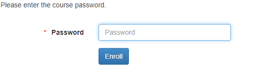
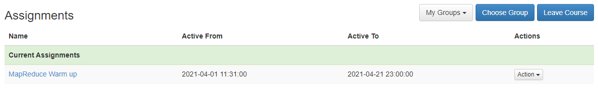
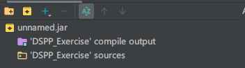
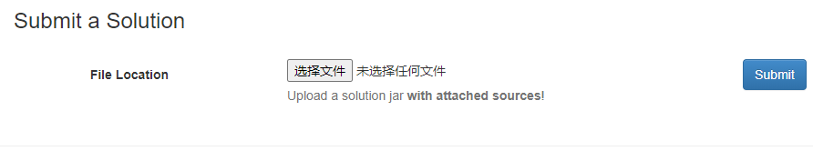

# 大师编程 (DaSE Programming) 训练平台

#### 1.注册DIMA Evaluation Tool账号

- 访问[DIMA Evaluation Tool](http://10.24.15.160:8080/)，点击register
- 在注册页面填入相关的信息，信息填写的相关要求如下
  - First Name/Last Name: 请使用汉语拼音 
  - University: 选 other, 填 ECNU
  - Semester: 2
  - Matriculation Number: 年份+序号, 不足六位请在序号前面补 0 (例如, 今年为2021年，序号为8的同学, 此处填写 202108;
    序号为 18 的同学, 此处填写 202118; 依此类推)

#### 2. 访问DIMA Evaluation Tool试题

- 在Current Courses选项下选择2021-Distributed Computing Systems (Exercise)课程

  然后在下图所示的界面中输入密码即可看到试题（Assignments），**密码将另行通知。**

  

  

#### 3. 本地编写试题答案

- 拉取本仓库到本地

  使用 SSH clone (如未设置 SSH key, 请先完成 [Gitlab SSH key 设置](./SSH.md)) 或使用 HTTPS clone. 命令为 `git clone URL` (其中 `URL` 见仓库右上角 clone)

- 进入代码目录 `cd distributedComputingSystems_exercise`

- 阅读DIMA Evaluation Tool试题的说明，使用命令 `git checkout XXX`切换至对应的试题分支, 其中 `XXX` 代表分支名称 (如 mapreduce_warm_up 等) (**切换之前请参考最后一条保存当前分支进度**)

- 通过 Intellij IDEA 中导入当前试题分支下的 Maven 工程

- 进行编码及调试

  - 阅读当前试题分支下的README，然后根据说明补充相应代码

  - 运行 junit test 中的测试代码

    以 mapreduce_warm_up 为例，在 Intellij IDEA 中打开 `src/test/java/DSPPTest/student/mapreduce/warm_up/WordCountTest.java`

    按 Ctrl + Shift + F10 运行，或右键选择 Run 'WordCountTest.java'

  - 查看测试是否通过，并根据需要进行调试

- 获取新题: 题目会陆续上线, 使用 `sh pull_new_assignment.sh` 获取新题分支 (**获取之前请参考最后一条保存当前分支进度**)

- 在做题过程中若要切换分支, 使用 `git add . ; git commit -m "v"` 保存当前分支进度

#### 4. 提交代码

- 本地测试通过后通过 Intellij IDEA 导出 JAR 包

  - 选择 File → Project Structure → Artifacts → + JAR → Empty, 点击 Output Layout 下的加号，**选择 Module Output 和 Module Sources**

    最终效果如下图所示

    

  - 选择 Build → Build Artifacts，在弹框中选择新建的 artifacts 进行 rebuild，JAR将包生成在 out 目录下或 classes 目录下

- 在 DIMA Evaluation Tool 中的试题中点击 Submit a solution 以提交 JAR 包，提交界面如下图所示

  

  

